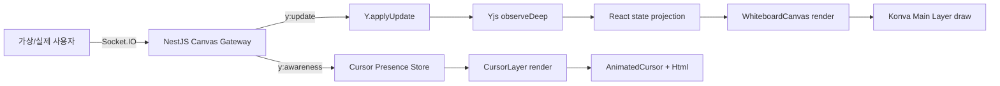

# 캔버스 부하 테스트부터 커서 병목을 찾기까지

데모 때 여러 명이 한꺼번에 접속하고 캔버스에 객체가 많아지자 화면이 눈에 띄게 느려졌다. 그때는 어디가 문제인지 확인할 수 있는 수치가 없었고, 데모에 참여했던 사람들을 다시 모아 같은 상황을 만드는 것도 어려웠다.

그래서 바로 최적화부터 하기보다는, 먼저 로컬에서 당시 상황을 반복해서 만들 수 있는 부하 테스트 도구와 브라우저 계측을 추가했다. 이 글은 느려짐을 다시 재현하고, mixed 테스트에서 cursor-only 테스트로 범위를 좁혀 첫 번째 최적화 대상을 정하기까지의 기록이다.

## 요약

먼저 결론부터 적으면 다음과 같다.

- medium fixture와 가상 사용자 30명의 혼합 부하에서 FPS 중앙값이 `19.32`까지 하락했다.
- cursor-only 부하에서도 FPS 중앙값이 `60 → 40.68`로 약 32% 하락했다.
- cursor-only에서는 Yjs update와 메인 Canvas draw가 없었다.
- 초당 평균 `295.23`건의 awareness가 정확히 같은 수의 Zustand store commit으로 이어졌다.
- Cursor Layer 자체 draw는 평균 `0.04ms`, p95 `0.2ms` 이하였다.

처음에는 객체가 많아서 Konva draw가 느릴 것이라고 생각했지만, 실제 첫 최적화 대상으로 고른 것은 Canvas draw가 아니라 **awareness 패킷마다 발생하는 store/React 갱신 과정**이었다.

## 1. 왜 이 작업을 시작했나

화이트보드는 React, React-Konva, Socket.IO, Yjs로 구현되어 있다. 데모에서 여러 사용자가 동시에 접속하고 캔버스 객체와 드로잉이 많아지자 다음 문제가 생겼다.

- 커서와 드로잉이 끊겨 보임
- 줌과 캔버스 이동이 즉각 반응하지 않음
- 사용자가 늘어날수록 조작 지연이 심해짐

문제는 느리다는 사실만 알았지 다음 중 어디가 원인인지는 알 수 없었다는 점이다.

1. Yjs update 적용
2. Yjs shared type을 React state로 변환하는 과정
3. React 렌더링
4. Konva 메인 Layer draw
5. 실시간 커서 렌더링
6. Socket.IO 직렬화 및 메시지 빈도

그래서 처음부터 특정 코드를 고치지 않기로 했다. 같은 조건을 반복해서 만들고, 어느 구간이 느린지 나눠 볼 수 있는 기준선을 먼저 만들기로 했다.

## 2. 먼저 데이터 흐름을 정리했다



캔버스 문서는 다음 Yjs shared type으로 관리된다.

```text
Y.Array<Y.Map> postits
Y.Array<Y.Map> placeCards
Y.Array<Y.Map> lines
Y.Array<Y.Map> textBoxes
Y.Map           zRankByKey
```

코드를 따라가 보니 하나의 Y.Map만 바뀌어도 해당 타입의 Y.Array 전체를 JavaScript 배열로 다시 변환하고 있었다. 이 부분은 병목 후보로 남겨뒀다. 실시간 커서는 Yjs 문서가 아니라 awareness 메시지로 따로 관리하고 있었다.

## 3. 사람 없이 같은 상황을 어떻게 만들었나

### 3.1 고정 fixture

매번 객체 위치나 개수가 바뀌면 전후 비교가 어려워지기 때문에 seed 기반 fixture를 만들었다.

| Profile | 포스트잇 | 장소 카드 | 라인 | 텍스트 | 라인당 좌표 쌍 | 총 객체 |
| ------- | -------: | --------: | ---: | -----: | -------------: | ------: |
| small   |       50 |        20 |   30 |     10 |             40 |     110 |
| medium  |      250 |       100 |  100 |     50 |            120 |     500 |
| large   |      600 |       200 |  200 |    100 |            240 |   1,100 |

동일한 `seed + profile` 조합은 Yjs marker를 확인해 중복 생성하지 않도록 했다. 화면에 가짜 객체만 그려 놓는 테스트가 되지 않도록 실제 서비스와 같은 Yjs 구조와 Socket.IO 이벤트를 사용했다.

### 3.2 시나리오

| Scenario | 부하 내용                               |
| -------- | --------------------------------------- |
| `seed`   | 고정 객체 생성                          |
| `cursor` | awareness 커서 좌표 전송                |
| `move`   | 포스트잇·장소 카드·텍스트 위치 변경     |
| `draw`   | 증가하는 `points` 배열 전체를 반복 교체 |
| `mixed`  | cursor + move + draw 동시 실행          |

`draw` 시나리오는 현재 클라이언트처럼 점이 추가될 때마다 전체 `points` 배열을 교체한다. 이 방식이 효율적이라고 가정한 것이 아니라, 라인이 길어질수록 update와 배열 복사 비용이 커지는 현재 동작을 그대로 재현하려고 이렇게 만들었다.

### 3.3 Yjs update echo 방지

가상 사용자마다 독립된 Socket.IO connection과 Y.Doc을 만들었다. 이때 원격 update를 적용하면서 Socket 객체를 origin으로 넘기고, 같은 origin에서 발생한 update는 다시 서버로 보내지 않도록 했다.

```ts
doc.on('update', (update, origin) => {
  if (origin === socket) return
  socket.emit('y:update', update)
})

Y.applyUpdate(doc, remoteUpdate, socket)
```

이 처리가 없으면 서버에서 받은 update를 다시 서버로 보내는 echo loop가 생긴다. 부하 도구가 실제 상황보다 훨씬 많은 트래픽을 만들어 내지 않도록 꼭 필요한 처리였다.

## 4. FPS만 보지 않고 구간을 나눠서 측정했다

`VITE_ENABLE_CANVAS_PERF=true`인 측정 build에서 다음 항목을 1초 단위로 수집했다.

- FPS, frame p95, 20ms 초과 frame 비율
- long task
- Yjs update 수와 binary 크기
- `Y.applyUpdate` 시간
- postit, placeCard, line, textBox, z-index projection 시간
- Konva Main Layer와 Cursor Layer draw 시간
- awareness 수신 횟수
- Cursor store commit 횟수

각 duration은 호출 횟수, 총시간, 평균, p95, 최댓값을 JSON으로 내보내도록 했다. raw JSON은 다시 계산할 때만 필요하므로 로컬 `docs/performance/results/raw/`에 보관하고 Git에는 올리지 않기로 했다.

## 5. 테스트 준비 중 초기 동기화 버그도 찾았다

fixture를 만든 뒤 브라우저를 새로고침해 기존 문서를 불러오는 과정에서 Socket.IO 이벤트명이 맞지 않는 것을 발견했다.

```text
서버 응답: canvas:attached, canvas:detached
기존 프론트 구독: canvas:attach, canvas:detach
```

요청 이벤트인 `attach`와 응답 이벤트인 `attached`를 상수에서 분리하고, `canvas:attached`를 받았을 때 실제 Yjs 초기 문서가 적용되는 테스트를 추가했다. 성능 작업에서 시작했지만, 이 문제를 그대로 두면 늦게 들어온 사용자가 기존 캔버스를 받지 못할 수 있어 먼저 수정했다.

## 6. 측정 환경

| 항목                 | 값                    |
| -------------------- | --------------------- |
| 측정일               | 2026-06-30            |
| 브라우저             | Chrome 148            |
| Viewport             | 1,524 × 1,002         |
| Device pixel ratio   | 1.6                   |
| 프론트엔드           | Vite production build |
| Fixture              | medium                |
| 가상 사용자          | 30명                  |
| cursor 빈도          | 사용자당 10Hz         |
| document update 빈도 | 사용자당 5Hz          |

## 7. 첫 번째로 mixed 부하를 걸어 봤다

### 7.1 조건

```text
scenario: mixed
clients: 30
duration: 60초
cursor-hz: 10
update-hz: 5
seed: 20260630
```

### 7.2 부하 도구 결과

| 지표                 |             결과 |
| -------------------- | ---------------: |
| 전송 Yjs update      |         17,862회 |
| awareness            |         17,550회 |
| Yjs binary           |  6,608,742 bytes |
| number[] JSON 직렬화 | 24,239,040 bytes |
| 직렬화 크기 비율     |        약 3.67배 |
| 초기 attach 평균     |         657.99ms |
| 초기 attach 최대     |         833.44ms |

`number[]` JSON 크기는 Yjs binary보다 약 3.67배 컸다. 이는 WebSocket framing을 포함한 실제 wire byte는 아니지만 현재 전송 표현의 직렬화 오버헤드를 보여준다.

### 7.3 브라우저 활성 구간 결과

JSON을 내보낸 시점까지 52개의 활성 표본을 분석했다.

| 지표                 |            결과 |
| -------------------- | --------------: |
| FPS 평균             |           31.56 |
| FPS 중앙값           |           19.32 |
| FPS 최저             |           14.99 |
| frame p95 중앙값     |          66.7ms |
| 수신 Yjs update      |        14,811회 |
| 수신 Yjs binary      | 5,963,886 bytes |
| Main Layer draw 평균 |     5.18ms/draw |
| Main Layer draw 누적 |       5,978.3ms |
| Yjs apply 평균       |   0.12ms/update |
| Yjs apply 누적       |       1,756.2ms |

일단 데모 때처럼 화면이 느려지는 현상은 다시 만들었다. 다만 첫 측정이라 조건을 완전히 통제하지 못한 부분도 있었다.

- 같은 실행에서 fixture를 생성해 초기 생성 트래픽이 섞였다.
- 화면 녹화가 활성화되어 GPU/영상 인코딩 비용이 포함됐다.
- 실행 중 라인이 0개에서 191개로 증가해 하나의 고정된 장면이 아니었다.
- production React Profiler callback이 동작하지 않아 React 비용이 `0ms`로 표시됐다.
- 당시에는 Cursor Layer draw를 별도로 측정하지 않았다.

그래서 이 수치를 그대로 최종 Before 결과로 쓰지는 않았다. “느려짐을 재현할 수 있다”는 것과 다음 실험에서 무엇을 분리해야 하는지를 확인한 탐색 결과로만 사용했다.

> **여기에 사진 1 넣기 — 부하 전 medium fixture**  
> 객체 500개, 라인 좌표 12,000쌍, FPS 60이 보이는 사진을 사용하면 된다.

<!--  -->

> **여기에 사진 2 넣기 — mixed 부하 약 50초 시점**  
> 가상 커서 30명과 드로잉이 같이 보이고 FPS가 약 19로 떨어진 사진을 사용한다. 화면 녹화가 포함된 탐색 측정이었다는 점도 캡션에 적는다.

<!--  -->

## 8. cursor-only로 범위를 좁혔다

mixed 결과만으로는 Yjs, Main Layer, 커서 중 무엇이 더 큰 문제인지 알 수 없었다. 하나씩 빼 보기 위해 문서 update 없이 awareness만 보내는 cursor-only 시나리오를 실행했다.

초기 cursor-only 측정에서 다음 결과를 확인했다.

```text
가상 커서: 30명
Yjs update: 0/s
Main Layer draw: 0ms
FPS: 약 41
frame p95: 약 33.4ms
```

Yjs와 메인 캔버스 변경이 없는데도 FPS가 떨어졌다. 여기서 커서 경로가 유력하다고 판단했지만, 아직 awareness 횟수와 Cursor Layer draw를 재고 있지 않아 바로 최적화하지 않고 계측을 한 번 더 보완했다.

> **여기에 사진 3 넣기 — 계측 보완 전 cursor-only 화면(선택)**  
> Yjs 수신과 Main Layer draw가 0인데 FPS가 약 41인 사진이다. 글이 너무 길면 이 사진은 빼도 된다.

<!--  -->

## 9. 첫 측정에서 부족했던 계측을 보완했다

cursor-only 결과를 설명하기 위해 다음 항목을 추가하거나 수정했다.

- awareness 수신 횟수
- Zustand Cursor store commit 횟수
- Cursor Layer draw duration
- production에서 React render 미측정 시 `0ms` 대신 `N/A` 표시
- 60Hz의 16.67ms 근처 타이머 오차를 줄이기 위해 slow frame 기준을 20ms로 변경
- JSON schema version을 2로 증가

## 10. 다시 측정해서 Cursor Before 기준선을 만들었다

### 10.1 조건

```text
scenario: cursor
clients: 30
duration: 90초
cursor-hz: 10
Yjs update: 없음
화면 녹화: 사용하지 않음
```

이 캔버스에는 앞선 mixed 실행 결과가 남아 있어서 객체 593개와 좌표 20,882쌍이 있었다. 완전히 깨끗한 medium fixture는 아니지만, 같은 JSON 안에 동일한 장면의 idle 9초와 cursor active 90초가 함께 들어 있고 테스트 중 객체 수도 바뀌지 않았다. 따라서 커서가 생기기 전후를 비교하는 기준선으로는 사용할 수 있다고 판단했다.

### 10.2 전체 표본 비교

| 지표                  |   Idle | Cursor 30명 |
| --------------------- | -----: | ----------: |
| 표본 수               |      9 |          90 |
| FPS 평균              |  58.78 |       40.68 |
| FPS 중앙값            |     60 |       40.68 |
| FPS 최저              |  49.00 |       36.61 |
| frame p95 중앙값      | 17.5ms |      33.4ms |
| 20ms 초과 비율 중앙값 |     0% |         47% |
| awareness/s 평균      |      0 |      295.23 |
| store commit/s 평균   |      0 |      295.23 |
| Yjs update            |      0 |           0 |
| Main Layer draw       |      0 |           0 |
| long task             |      0 |           0 |

### 10.3 Cursor Layer draw

| 지표                            |           결과 |
| ------------------------------- | -------------: |
| Cursor Layer draw 횟수          |        3,625회 |
| 누적 draw 시간                  | 145.3ms / 90초 |
| draw 평균                       |         0.04ms |
| 각 1초 구간의 draw p95 중앙값   |          0.1ms |
| 각 1초 구간의 draw p95 상위 95% |          0.2ms |

예상과 달리 Cursor Layer의 Canvas draw 시간은 FPS 하락을 설명하기에 너무 작았다. 반면 awareness와 store commit은 평균 `295.23/s`로 정확히 1:1이었다.

> **여기에 사진 4 넣기 — instrumented cursor-only Before 기준선(필수)**  
> `awareness 약 300/s`, `store 약 300/s`, `Cursor draw 약 0.1ms`, `FPS 약 40`, `frame p95 약 33.4ms`가 한 번에 보이는 최신 사진을 사용한다.

<!--  -->

## 11. 그래서 어디를 먼저 고칠지 정했다

cursor-only 결과를 기준으로 다음 경로는 첫 최적화 대상에서 일단 제외했다.

- Yjs update: cursor-only에서 발생하지 않음
- Yjs → React projection: cursor-only에서 발생하지 않음
- Main Layer draw: cursor-only에서 발생하지 않음
- Cursor Layer Canvas draw: 평균 0.04ms로 매우 작음
- 50ms 이상 long task: 관찰되지 않음

현재 구현은 awareness를 받을 때마다 새로운 Cursor Map을 만들고 Zustand `set()`을 호출한다.

```text
awareness 약 300회/s
→ Cursor store commit 약 300회/s
→ CursorLayer와 Html 커서 갱신
→ FPS 중앙값 60 → 40.68
```

물론 Cursor Layer draw에는 `react-konva-utils`의 `Html`이 만드는 DOM style/layout/composite 비용이 포함되지 않는다. production React Profiler도 비활성화되어 있어서 React가 정확히 몇 ms를 사용했는지는 알 수 없다. 그래도 **패킷과 store commit이 1:1이고 Canvas draw 시간은 매우 작다**는 두 가지 사실만으로도 상태 반영 횟수를 먼저 줄여 볼 근거는 충분하다고 판단했다.

## 12. 다음에는 awareness를 frame 단위로 묶어 본다

그래서 첫 최적화는 awareness 상태 반영을 animation frame 단위로 배치하는 것으로 정했다.

```text
현재
awareness 약 300회/s → store commit 약 300회/s

목표
awareness 약 300회/s → store commit 최대 60회/s
```

각 Socket의 최신 awareness만 pending Map에 보관하고 다음 `requestAnimationFrame`에서 한 번에 Zustand state로 반영할 예정이다. 같은 frame 안에 동일 사용자의 좌표가 여러 번 오면 중간 좌표는 버리고 최신 좌표만 사용한다.

### 성공 기준

동일한 객체 수와 `30명 × 10Hz × 90초` 조건에서 다음 목표를 사용한다.

| 지표             | Before |      목표 |
| ---------------- | -----: | --------: |
| awareness/s      | 약 295 |      유지 |
| store commit/s   | 약 295 |   60 이하 |
| FPS 중앙값       |  40.68 |   55 이상 |
| frame p95 중앙값 | 33.4ms | 20ms 이하 |

배치 처리만으로 목표를 달성하지 못하면 그때 다음 순서로 범위를 넓힐 생각이다.

1. 커서마다 생성되는 `Konva.Animation`을 Layer 단위로 통합
2. `Html` 기반 커서의 DOM style/layout/composite 비용을 Chrome Performance로 분석
3. 필요하면 순수 Konva 또는 별도 DOM overlay 구조 비교

## 13. 재현 명령

### 측정용 프론트엔드

```bash
VITE_ENABLE_CANVAS_PERF=true pnpm --filter frontend build
pnpm --filter frontend preview
```

### cursor-only Before 기준선

```bash
pnpm --filter frontend perf:canvas:load -- \
  --room-id <ROOM_ID> \
  --canvas-id <CANVAS_ID> \
  --scenario cursor \
  --profile medium \
  --clients 30 \
  --duration 90 \
  --cursor-hz 10 \
  --seed 20260630
```

## 14. 관련 커밋

| Commit    | 내용                                             |
| --------- | ------------------------------------------------ |
| `1bf9f84` | 초기 동기화 응답 이벤트 구독 수정 및 회귀 테스트 |
| `2318fe0` | 고정 fixture와 가상 사용자 부하 도구 추가        |
| `c0f75b0` | Yjs·React·Konva 런타임 구간별 계측 추가          |
| `4a0e7b5` | 로컬 DB와 raw 성능 결과 Git 추적 제외            |
| `f3adacf` | awareness/store/Cursor Layer 계측 보완           |

검증 항목은 다음과 같다.

- frontend Vitest 통과
- frontend ESLint 통과
- TypeScript 및 Vite production build 통과
- backend Canvas Gateway 계약 테스트 통과
- 임시 Socket.IO/Yjs 서버를 이용한 부하 클라이언트 smoke test 통과

## 15. Wiki에 올릴 사진 정리

| 우선순위 | 사진                     | 사용 위치 | 캡션 핵심                                              |
| -------: | ------------------------ | --------- | ------------------------------------------------------ |
|     필수 | 부하 전 medium fixture   | 실험 1    | 객체 500개·좌표 12,000쌍·FPS 60                        |
|     필수 | mixed 약 50초            | 실험 1    | FPS 약 19, 동시 커서와 드로잉, 탐색 측정임을 명시      |
|     선택 | 계측 보완 전 cursor-only | 실험 2    | Yjs/Main draw 0인데 FPS 약 41                          |
|     필수 | instrumented cursor-only | 실험 3    | awareness/store 약 300/s, Cursor draw 0.1ms, FPS 약 40 |

터미널 JSON 전체와 raw 성능 JSON은 사진으로 올리지 않을 생각이다. 수치는 본문의 표가 더 읽기 쉽고, 원본 파일은 나중에 다시 계산할 수 있도록 로컬에만 보관한다.

## 16. 이 글 이후에 할 작업

여기까지를 기준선 측정 작업으로 병합하고, 다음 브랜치에서 실제 최적화를 시작할 예정이다.

```text
branch: perf/cursor-awareness-batching
commit: perf: 커서 awareness 반영을 프레임 단위로 배치
```

첫 최적화 PR에는 awareness 배치 처리만 넣고 같은 cursor-only 조건으로 Before/After를 비교한다. animation 통합이나 Html 제거까지 한 번에 넣으면 어떤 변경이 효과가 있었는지 알기 어려우므로, 첫 결과를 본 뒤 다음 작업으로 분리할 생각이다.
