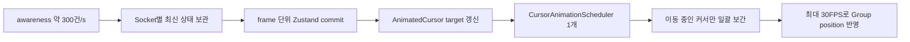

# awareness 배치만으로 부족했던 커서 병목을 공유 Scheduler로 해결하기

앞선 글에서는 데모에서 경험한 느려짐을 로컬에서 다시 만들 수 있도록 부하 테스트와 브라우저 계측을 추가했다. mixed 테스트에서 시작해 cursor-only까지 범위를 좁힌 결과, 객체 593개와 라인 좌표 20,882쌍이 있는 캔버스에서 가상 커서 30명만 움직여도 FPS가 `60 → 40.68`로 떨어지는 것을 확인했다.

당시에는 초당 약 295건의 awareness가 거의 같은 수의 Zustand store commit으로 이어지고 있었기 때문에, 첫 번째 원인을 상태 반영 횟수라고 생각했다. 이 글은 그 가설을 실제로 검증하고, 가설이 충분하지 않다는 결과를 받아들인 뒤 커서 애니메이션 실행 구조까지 범위를 넓혀 최종적으로 안정 구간 약 60FPS를 만든 과정이다.

## 요약

먼저 결론부터 적으면 다음과 같다.

- awareness를 frame 단위로 배치해 store commit을 평균 `295.23/s → 19.23/s`로 93.5% 줄였다.
- 하지만 FPS는 `40.68 → 39.77`로 개선되지 않았다.
- 커서를 `Html`에서 순수 Konva 중심으로 바꿔도 지속 부하 FPS는 `39.46`으로 거의 같았다.
- 실제 구현에는 커서마다 하나씩, 총 30개의 장수명 `Konva.Animation` 인스턴스가 있었다.
- 이를 Cursor Layer당 하나의 공유 Scheduler로 통합하고, 원격 커서 위치 반영을 최대 30FPS로 제한했다.
- 최종 60초 측정의 FPS 평균은 `57.58`, 중앙값은 `60`이었다.
- 초기 6초 warm-up을 제외한 54초의 FPS 평균은 `59.72`, frame p95 중앙값은 `17.3ms`였다.
- 같은 조건으로 한 번 더 반복했을 때도 60FPS를 유지하는 같은 경향을 확인했다.

결과적으로 네트워크 입력량을 줄인 것이 아니라, **상태 수신 빈도와 화면 렌더링 빈도를 분리하고 여러 커서의 실행 시점을 중앙에서 제어하는 방식**으로 병목을 해결했다.

## 1. 이전 글에서 세운 첫 번째 가설

cursor-only Before 기준선은 다음과 같았다.

| 지표                  | 결과        |
| --------------------- | ----------: |
| 가상 사용자           |        30명 |
| 사용자별 cursor 빈도  |        10Hz |
| awareness 평균        |    295.23/s |
| store commit 평균     |    295.23/s |
| FPS 평균·중앙값       |       40.68 |
| frame p95 중앙값      |      33.4ms |
| 20ms 초과 비율 중앙값 |         47% |
| Cursor Layer draw 평균 |      0.04ms |
| Yjs update            |           0 |
| Main Layer draw       |           0 |

Yjs update와 Main Layer draw가 없고 Cursor Layer draw도 매우 작았다. 반면 awareness와 store commit은 거의 정확히 1:1이었다.

그래서 다음 흐름을 첫 번째 병목으로 예상했다.

```text
awareness 약 300회/s
→ Zustand set 약 300회/s
→ CursorLayer와 Html 커서 갱신
→ FPS 약 40
```

첫 성공 기준은 awareness 양은 유지하면서 store commit을 60회 이하로 줄이고, FPS를 55 이상으로 회복하는 것이었다.

## 2. awareness를 animation frame 단위로 배치했다

같은 사용자의 커서 좌표는 순서대로 모두 보존해야 하는 이벤트 로그가 아니라 현재 위치를 나타내는 최신 상태다. 따라서 같은 frame 안에 한 사용자에게서 여러 좌표가 오면 중간 좌표를 모두 React state에 반영할 필요가 없다고 판단했다.

Socket ID를 key로 사용하는 pending Map에 최신 awareness만 보관하고, 하나의 `requestAnimationFrame`에서 한 번에 Zustand state로 반영하도록 변경했다.

```text
수신
socket-a: (10, 10)
socket-b: (20, 20)
socket-a: (30, 30)

다음 frame에 반영
socket-a: (30, 30)
socket-b: (20, 20)
```

구현에서 지키려고 한 조건은 다음과 같다.

- 같은 frame에서는 RAF를 한 번만 예약한다.
- 동일 사용자의 중간 좌표는 버리고 최신 좌표만 남긴다.
- 여러 사용자의 변경을 하나의 새 Map과 하나의 Zustand `set()`으로 반영한다.
- 기존 값과 완전히 같은 좌표·이름·채팅 상태는 commit하지 않는다.
- 캔버스를 나갈 때 pending awareness와 예약된 RAF를 함께 취소한다.

테스트에서는 같은 frame의 여러 사용자, 동일 사용자의 최신 좌표 우선, 사용자 제거, clear 이후 이전 커서가 되살아나지 않는 것을 확인했다.

## 3. store commit은 줄었지만 FPS는 그대로였다

동일한 장면과 `30명 × 10Hz × 90초` 조건으로 다시 측정했다.

| 지표                  | 배치 전 | awareness 배치 후 |
| --------------------- | ------: | ----------------: |
| awareness 평균        | 295.23/s |          293.74/s |
| store commit 평균     | 295.23/s |           19.23/s |
| store commit 중앙값   |       300 |                16 |
| FPS 평균              |     40.68 |             39.77 |
| FPS 중앙값            |     40.68 |                40 |
| frame p95 중앙값      |    33.4ms |            33.7ms |
| 20ms 초과 비율 중앙값 |      47%|               50% |
| long task             |        0|                 0 |

store commit은 약 93.5% 감소해 구현 목표를 달성했다. 그러나 사용자 경험을 나타내는 FPS와 frame p95는 개선되지 않았다.

처음에는 awareness와 store commit이 1:1이고 FPS도 함께 떨어졌기 때문에 둘 사이에 강한 인과관계가 있을 것이라고 생각했다. 하지만 이 결과로 알 수 있었던 것은 **높은 store commit은 분명 비효율적이지만, 40FPS를 만드는 주된 병목은 아니었다**는 점이다.

이 변경은 의미가 없지는 않았다. burst 형태의 awareness를 최신 상태 하나로 합쳐 React에 전달하는 backpressure가 생겼고, 사용자 수나 패킷 빈도가 더 커질 때 상태 계층이 그대로 증폭되는 것을 막았다. 다만 이 결과만으로 성능 개선이 끝났다고 말할 수는 없었다.

> **여기에 사진 1 넣기 — awareness 배치 후에도 FPS가 약 40인 화면(필수)**  
> `awareness 약 300/s`, `store 약 16/s`, `FPS 약 40`, `frame p95 약 33.6ms`가 함께 보이는 사진을 사용한다. store commit 감소만으로 FPS가 회복되지 않았다는 캡션을 붙인다.

<!--  -->

## 4. 저빈도 테스트로 정지 상태와 이동 상태를 분리했다

다음 후보를 찾기 위해 cursor 빈도를 사용자당 `0.1Hz`, 즉 10초에 한 번으로 낮췄다. 커서 30개는 화면에 그대로 두고, 좌표가 바뀌는 순간과 모두 멈춘 순간을 비교하기 위한 실험이었다.

```text
clients: 30
cursor-hz: 0.1
한 번에 30개의 새 목표 좌표 수신
```

커서가 멈춰 있을 때는 약 60FPS였다. 30개 커서가 새 좌표로 움직이기 시작하면 약 46~56FPS까지 떨어졌고, 이동이 끝나면 다시 60FPS로 돌아왔다.

이 결과로 커서 30개가 DOM에 존재하는 것 자체보다 **커서 좌표가 계속 변경되는 동안 수행되는 animation과 transform 갱신**을 먼저 의심하게 됐다.

당시 각 `AnimatedCursor`는 마운트될 때 하나의 `Konva.Animation`을 생성하고 있었다. awareness마다 animation을 새로 만드는 구조는 아니었지만, 커서가 30명이면 30개의 animation 인스턴스와 보간 callback이 계속 유지되는 구조였다.

```text
AnimatedCursor 30개
→ Konva.Animation 30개
→ 각 callback에서 current → target 보간
→ 각 Group의 x, y 변경
→ Html absolute transform 동기화
```

Cursor Layer draw 계측은 Canvas draw 이벤트 사이의 시간만 측정하고 있었다. animation callback에서 좌표를 계산하고 Konva node 속성을 바꾸는 시간과 `react-konva-utils`의 `Html`이 DOM transform을 갱신하는 후속 비용은 이 수치에 완전히 포함되지 않았다. Cursor draw p95가 0.1ms인데도 FPS가 떨어지는 이유를 설명하려면 계측 경계 밖의 작업도 봐야 했다.

## 5. Html을 제거하면 해결될지 먼저 확인했다

`Html`이 좌표 변경마다 absolute transform을 계산하고 DOM style을 갱신하는 것을 확인한 뒤, 일반 커서 아이콘과 이름표를 Konva 도형으로 바꾸는 실험을 했다. 채팅 중인 커서만 기존 Html을 유지하는 방식이었다.

저빈도 테스트에서는 움직인 뒤 FPS가 회복되는 시간이 다소 짧아 보였다. 하지만 중요한 것은 cursor가 계속 움직이는 10Hz 지속 부하였다.

| 지표                  | awareness 배치 후 | Konva 표현 실험 |
| --------------------- | ----------------: | ---------------: |
| 활성 표본             |                90 |               73 |
| FPS 평균              |             39.77 |            39.46 |
| FPS 중앙값            |                40 |               40 |
| frame p95 중앙값      |            33.7ms |           33.9ms |
| 20ms 초과 비율 평균   |             50.9% |            52.2% |
| awareness 평균        |          293.74/s |         294.25/s |

지속 부하에서는 유의미한 개선이 없었다. 커서 모양을 Canvas로 옮기면 구현 복잡도와 시각적 차이는 생기는데 성능 이득은 확인되지 않았기 때문에 이 변경은 커밋하지 않고 되돌렸다.

이 실험으로 Html을 무조건 제거하는 것보다, **몇 개의 animation callback이 어떤 빈도로 좌표 변경을 만드는지**를 제어하는 쪽으로 우선순위를 바꿨다.

> **여기에 사진 2 넣기 — Konva 표현 실험 화면(선택)**  
> 커서 모양이 Konva 기반으로 바뀌었지만 FPS가 여전히 약 40인 사진이다. 최종 구현에는 포함되지 않은 기각된 실험임을 캡션에 명시한다. 글이 길면 생략해도 된다.

<!--  -->

## 6. 개별 Animation을 공유 Scheduler로 바꿨다

최종 구현에서는 커서가 자신의 animation을 소유하지 않도록 했다. Cursor Layer가 하나의 `CursorAnimationScheduler`를 만들고, 각 커서는 자신의 Konva Group과 현재 좌표를 처음 한 번 등록한다. 이후 awareness가 들어오면 animation을 만들거나 직접 움직이지 않고 목표 좌표만 Scheduler에 전달한다.



Scheduler 내부에는 두 자료구조가 있다.

```text
entries: Map<cursorId, { node, current, target }>
activeCursorIds: Set<cursorId>
```

- `entries`는 등록된 커서의 Konva node, 현재 좌표, 목표 좌표를 보관한다.
- `activeCursorIds`에는 현재 위치와 목표 위치가 다른 커서만 들어간다.
- 여러 커서의 목표가 한꺼번에 바뀌어도 RAF는 하나만 예약한다.
- 한 frame에서 이동 중인 커서를 순회해 함께 위치를 갱신한다.
- 목표에 도착한 커서는 active Set에서 제거한다.
- 이동 중인 커서가 하나도 없으면 RAF 예약을 완전히 중단한다.
- Cursor Layer가 unmount되면 pending RAF와 등록 정보를 정리한다.

기존에는 커서 30개가 각각 animation callback을 가지고 있었다. Konva 내부에서 Layer draw 자체는 합쳐질 수 있지만, 각 animation의 callback과 각 Group의 좌표 변경은 여전히 수행된다. 변경 후에는 실행 시점을 Scheduler 하나가 통제한다.

### 6.1 원격 커서에 30FPS 예산을 두었다

원격 커서는 애플리케이션의 버튼, 줌, 드래그와 같은 핵심 상호작용보다 우선순위가 낮다. 전체 UI는 60FPS를 목표로 유지하되 원격 커서 위치 반영은 최대 30FPS로 제한했다.

단순히 frame을 절반으로 줄이면 기존의 `lerpFactor = 0.2`가 적용되는 횟수도 줄어 목표까지 도달하는 시간이 길어진다. 이를 막기 위해 경과 시간에 따라 보간율을 계산했다.

```ts
const lerpFactor = 1 - Math.pow(1 - 0.2, elapsedMs / (1000 / 60))
```

60FPS의 약 16.67ms에서는 기존과 같은 0.2가 되고, 30FPS의 약 33.33ms에서는 약 0.36이 된다. 렌더 횟수는 줄어도 실제 시간 기준 이동 속도와 감쇠 정도는 비슷하게 유지된다.

브라우저의 60Hz timestamp가 33.33ms보다 아주 작게 찍혀 20FPS로 내려가는 경계 문제를 피하기 위해 1ms 허용 오차도 두었다. 탭이 백그라운드에 있었다가 돌아왔을 때 지나치게 큰 한 번의 이동이 발생하지 않도록 한 frame에서 사용하는 경과 시간은 최대 100ms로 제한했다.

### 6.2 목표에 도착하면 실행을 멈췄다

목표와의 거리가 0.5px보다 작아지면 정확한 목표 좌표로 보정하고 active Set에서 제거한다. 이때 매 frame `Math.sqrt`를 호출하지 않도록 제곱 거리로 비교했다.

```ts
const distanceSquared = dx * dx + dy * dy

if (distanceSquared < 0.5 ** 2) {
  // target으로 보정하고 active Set에서 제거
}
```

이 구조에서는 커서가 정지한 동안 animation callback과 Cursor Layer draw가 발생하지 않는다.

## 7. 수신 계층과 렌더링 계층에 각각 backpressure가 생겼다

최종 커서 파이프라인은 두 단계로 입력량을 제어한다.

```text
1. 상태 반영 backpressure
같은 frame의 awareness
→ Socket별 최신 상태만 선택
→ 하나의 Zustand commit

2. 렌더링 backpressure
React에 반영된 최신 target
→ 공유 Scheduler가 수집
→ 최대 30FPS로 실제 위치 변경
```

중간 좌표는 의도적으로 생략하지만 서버가 보낸 최신 커서 상태는 유지한다. 커서 위치는 모든 중간 지점을 반드시 재생해야 하는 금융 거래나 편집 이력이 아니라 현재 위치가 중요한 일시적 presence 데이터이기 때문에 이 선택이 가능했다.

## 8. Scheduler 동작을 테스트로 고정했다

Scheduler 단위 테스트에서는 다음 동작을 검증했다.

1. 커서 30개의 목표가 동시에 바뀌어도 하나의 RAF만 예약되는가
2. 한 RAF에서 여러 커서 위치를 함께 갱신하는가
3. 실제 위치 반영이 최대 30FPS로 제한되는가
4. 목표에 도착하면 다음 frame을 예약하지 않는가
5. clear 시 pending RAF가 취소되는가

awareness store 테스트와 함께 실행해 수신 배치와 렌더링 배치가 각각 독립적으로 동작하는 것도 확인했다.

검증 결과는 다음과 같다.

- frontend Vitest 8개 통과
- frontend ESLint 통과
- TypeScript 및 Vite production build 통과

## 9. 최종 측정 조건

| 항목                | 값                    |
| ------------------- | --------------------- |
| 측정일              | 2026-07-01            |
| 브라우저            | Chrome 148            |
| Viewport            | 1,524 × 1,002         |
| Device pixel ratio  | 1.6                   |
| 프론트엔드          | Vite production build |
| 캔버스 객체         | 593개                 |
| 라인 좌표           | 20,882쌍              |
| 가상 사용자         | 30명                  |
| cursor 빈도         | 사용자당 10Hz         |
| 측정 시간           | 60초                  |
| Yjs document update | 없음                  |
| 화면 녹화           | 사용하지 않음         |

테스트 전 오버레이를 초기화했고, 활성 구간은 커서 30명과 awareness 수신이 모두 확인되는 표본만 사용했다.

## 10. 최종 결과

### 10.1 전체 활성 60초

| 지표                       | awareness 배치 후 | 공유 Scheduler |
| -------------------------- | ----------------: | -------------: |
| 활성 표본                  |                90 |             60 |
| FPS 평균                   |             39.77 |          57.58 |
| FPS 중앙값                 |                40 |             60 |
| frame p95 중앙값           |            33.7ms |         17.3ms |
| 20ms 초과 비율 평균        |             50.9% |           4.23% |
| 20ms 초과 비율 중앙값      |               50% |              0% |
| 58FPS 이상 표본            |              1.1% |           86.7% |
| awareness 평균             |          293.74/s |       294.57/s |
| store commit 평균          |           19.23/s |        36.85/s |
| Cursor Layer draw 평균     |           39.14/s |         28.80/s |
| Cursor Layer draw 평균 시간 |           0.042ms |        0.036ms |

전체 평균 FPS는 `39.77 → 57.58`로 약 44.8% 증가했다. awareness는 계속 약 295건/s였기 때문에 부하 도구가 덜 보낸 결과가 아니다. Cursor Layer draw 빈도는 약 39회/s에서 29회/s로 줄어 의도한 30FPS 예산과 거의 일치했다.

store commit이 평균 19.23/s에서 36.85/s로 다시 늘어난 것은 회귀로 보지 않았다. awareness 배치는 browser frame에 맞춰 flush되는데, 전체 FPS가 약 40에서 60으로 회복되면서 pending 상태가 더 자주 반영될 수 있게 됐기 때문이다. store commit이 늘어난 상태에서도 UI는 60FPS를 유지했다.

### 10.2 warm-up 이후 안정 구간

커서 30명이 처음 들어온 뒤 첫 6초에는 FPS가 일시적으로 크게 떨어졌다. 이 구간에는 50ms long task 1회가 있었지만 나머지 하락은 long task만으로 설명되지 않았다. 다중 Html 커서 mount, 브라우저 초기화, 시스템 간섭 중 무엇이 원인인지는 이번 작업에서 분리하지 못했다.

이 구간을 별도로 표시하고 이후 54초를 안정 구간으로 계산했다.

| 지표                     | 안정 구간 결과 |
| ------------------------ | -------------: |
| 표본 수                  |             54 |
| FPS 평균                 |          59.72 |
| FPS 중앙값               |             60 |
| FPS 하위 5%              |          59.94 |
| 58FPS 이상 표본          |          96.3% |
| frame p95 중앙값         |         17.3ms |
| 20ms 초과 비율 평균      |           0.31% |
| 느린 frame이 없는 표본   |          96.3% |
| awareness 평균           |        296.59/s |
| store commit 평균        |         38.74/s |
| Cursor Layer draw 평균   |         29.65/s |

추가로 같은 60초 테스트를 반복했을 때도 60FPS를 유지하는 같은 경향을 확인했다. 따라서 최종 결론은 다음처럼 정리했다.

> 객체 593개와 라인 좌표 20,882쌍이 있는 캔버스에서 가상 사용자 30명이 초당 약 300건의 커서 좌표를 전송하는 지속 부하를 재현했다. awareness 상태 배치와 Layer 단위 공유 Scheduler, 원격 커서 30FPS 예산을 적용해 FPS 평균을 39.77에서 57.58로 개선했고, warm-up 이후에는 평균 59.72FPS를 유지했다.

> **여기에 사진 3 넣기 — 공유 Scheduler 적용 후 최종 화면(필수)**  
> `awareness 약 300/s`, `FPS 60`, `frame p95 약 17.4ms`, `20ms 초과 0%`, `Cursor draw p95 약 0.1ms`가 보이는 최종 사진을 사용한다.

<!--  -->

## 11. 이번 작업에서 알게 된 점

### 11.1 상관관계만으로 병목을 확정하면 안 됐다

awareness와 store commit이 1:1이고 FPS가 함께 떨어진다는 사실은 좋은 출발점이었다. 하지만 store commit을 93.5% 줄이고도 FPS가 그대로였기 때문에 이것만으로 원인을 확정할 수는 없었다.

배치 처리 결과가 실패한 것이 아니라 다음 병목으로 범위를 좁힌 실험 결과였다. 이 결과가 없었다면 React 상태 처리, Html 제거, Konva draw 최적화를 한 번에 바꿔 어떤 변경이 효과가 있었는지 설명하기 어려웠을 것이다.

### 11.2 계측값이 작아도 측정 범위 밖에 비용이 있을 수 있다

Cursor Layer draw 평균은 처음부터 약 0.04ms였다. 하지만 이 값은 animation callback, node 속성 변경, Html DOM transform 이후 브라우저 렌더링 단계를 모두 포함한 end-to-end 비용이 아니었다.

계측 숫자만 보고 “Canvas draw가 작으니 렌더링은 문제가 아니다”라고 결론 내리지 않고, 어떤 코드 구간부터 어떤 구간까지 잰 값인지 다시 확인하는 것이 중요했다.

### 11.3 입력 빈도와 표현 빈도는 같을 필요가 없었다

네트워크에서는 최신 위치를 빠르게 받아야 하지만, 원격 커서 30개를 모두 60FPS로 표현할 필요는 없었다. 최신 상태는 유지하면서 표현만 30FPS로 제한하자 핵심 UI의 frame budget을 확보할 수 있었다.

이 방식은 데이터를 누락한 것이 아니라 presence 데이터의 의미에 맞게 처리 우선순위를 정한 것이다.

## 12. 트레이드오프와 남은 문제

### 12.1 원격 커서는 최대 30FPS다

전체 UI의 60FPS를 보호하기 위해 원격 커서 이동은 최대 30FPS로 제한했다. 테스트에서 체감상 충분히 부드러웠지만, 저사양 기기와 고주사율 화면에서도 같은 기준이 적절한지는 추가 검증이 필요하다.

### 12.2 최종 개선의 세부 기여도는 분리하지 않았다

최종 변경에는 다음 세 가지가 함께 들어갔다.

1. 커서별 Animation을 공유 Scheduler 하나로 통합
2. 실제 위치 변경을 최대 30FPS로 제한
3. 정지 시 RAF 중단

이 세 변경은 하나의 실행 모델을 구성하기 때문에 같이 적용했지만, 이번 수치만으로 각각이 FPS 개선에 몇 퍼센트 기여했는지는 알 수 없다.

### 12.3 최초 다중 접속 구간은 남아 있다

첫 측정에서 커서 30명이 처음 나타난 뒤 약 6초간 불안정한 구간이 있었다. 지속 부하는 해결했지만, 동시에 많은 사용자가 입장할 때 발생하는 cursor mount와 초기 렌더링 비용은 별도 과제로 남겼다.

### 12.4 mixed 부하는 다시 측정해야 한다

이번 작업은 cursor-only 병목을 해결했다. 처음 mixed 테스트의 FPS 중앙값 19.32에는 커서 외에 Yjs update, projection, Main Layer draw가 함께 들어 있었다. 커서 병목을 제거한 현재 코드에서 mixed 기준선을 다시 만들어야 다음 병목을 정확히 선택할 수 있다.

## 13. 관련 커밋

| Commit    | 내용                                             |
| --------- | ------------------------------------------------ |
| `ab6a70a` | awareness를 frame 단위로 배치하고 최신 상태 반영 |
| `739782c` | 커서 animation을 Layer 단위 Scheduler로 통합     |

```text
branch: perf/cursor-awareness-batching
PR: 실시간 커서 업데이트 및 애니메이션 처리 최적화
```

## 14. Wiki에 올릴 사진 정리

| 우선순위 | 사진                         | 사용 위치 | 캡션 핵심                                                   |
| -------: | ---------------------------- | --------- | ----------------------------------------------------------- |
|     필수 | awareness 배치 후            | 실험 1    | store 300/s → 약 16/s, FPS는 여전히 약 40                   |
|     선택 | 저빈도 cursor 이동           | 실험 2    | 이동 중 FPS 하락, 정지 후 60FPS 회복                        |
|     선택 | Konva 표현 실험              | 실험 3    | Html을 줄여도 지속 부하 FPS 약 40, 최종 구현에서는 되돌림   |
|     필수 | 공유 Scheduler 적용 후       | 최종 결과 | awareness 약 300/s, FPS 60, frame p95 약 17ms, 느린 frame 0% |

앞선 글의 instrumented cursor-only Before 사진과 이번 글의 최종 After 사진을 나란히 배치하면 변화가 가장 잘 보인다. raw JSON과 터미널 출력 전체는 사진으로 올리지 않고 표로 정리한다.

## 15. 다음 작업

이 브랜치의 목표였던 cursor-only 지속 부하 개선은 여기서 마무리한다. 현재 변경을 병합한 뒤 다음 브랜치에서는 최적화된 커서 구현을 포함한 상태로 mixed 부하를 다시 측정한다.

현재 기준으로는 다음 순서를 생각하고 있다.

1. cursor + move + draw mixed 기준선 재측정
2. Yjs projection과 Main Layer draw를 다시 분리
3. Main Layer가 크면 viewport culling과 hit graph 범위 축소
4. projection이 크면 Yjs 변경 객체만 반영하는 증분 projection
5. 라인 update와 전송량이 크면 points 구조와 binary 전송 개선

```text
next branch: perf/canvas-render-culling
```
