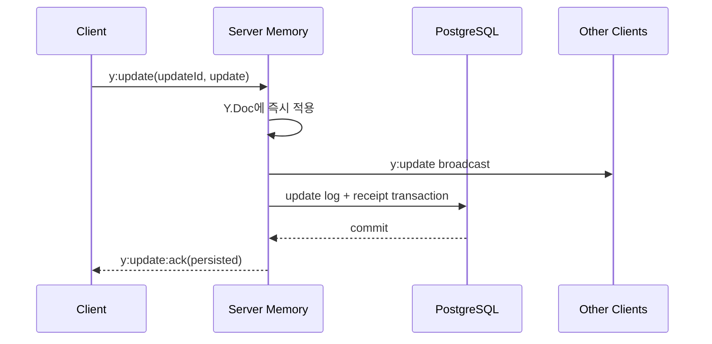

# Yjs update를 DB 저장 완료까지 추적하는 durable ack 만들기

앞선 작업에서는 재접속한 서버와 클라이언트가 state vector를 교환해 상태를 수렴시키고, DB에 누적되는 update log를 snapshot으로 압축했다. 하지만 클라이언트가 `y:update`를 보낸 시점과 서버가 해당 update를 DB에 저장한 시점 사이에는 여전히 차이가 있었다.

기존 서버는 update를 메모리 Y.Doc에 적용하고 다른 사용자에게 즉시 브로드캐스트한 뒤, 5초마다 update들을 병합해 DB에 저장했다. 이 구간에서 서버가 강제 종료되면 클라이언트는 전송을 끝냈다고 생각하지만 DB에는 변경이 없는 상태가 될 수 있었다.

이번 작업에서는 각 update를 UUID로 식별하고, DB transaction이 commit된 이후에만 송신 클라이언트에게 durable ack를 반환하도록 변경했다.

## 1. exactly-once 대신 at-least-once와 멱등 처리를 선택했다

네트워크에서는 서버가 저장을 완료한 직후 ack가 유실될 수 있다.

```text
클라이언트 update 전송
→ 서버 DB 저장 성공
→ ack 전송 중 연결 끊김
→ 클라이언트는 저장 성공 여부를 알 수 없음
```

클라이언트가 안전을 위해 update를 다시 보내면 서버에는 같은 요청이 두 번 도착한다. 전송과 ack를 원자적으로 묶을 수 없으므로 exactly-once delivery를 주장하지 않았다.

대신 다음 규칙을 사용했다.

```text
클라이언트: ack가 올 때까지 같은 updateId로 재전송
서버: updateId receipt가 있으면 다시 저장하지 않고 duplicate ack
```

전송은 한 번 이상 일어날 수 있지만, 서버의 상태 변경은 update ID 기준으로 멱등 처리한다.

## 2. 클라이언트 update에 UUID를 부여했다

로컬 Y.Doc에서 update가 발생하면 프론트엔드 outbox가 UUID를 생성한다.

```ts
{
  canvasId,
  updateId: crypto.randomUUID(),
  update: Array.from(update),
}
```

outbox는 다음 정보를 메모리에 보관한다.

- 전송 payload
- 마지막 전송 시각
- 전송 시도 횟수

서버 ack를 받으면 같은 `canvasId + updateId`의 pending 항목을 제거한다. 10초 동안 ack가 없고 Socket과 Yjs 동기화가 완료된 상태라면 같은 payload를 다시 전송한다.

## 3. 서버는 실시간 반영과 durable 완료를 구분한다

사용자 간 실시간 반응성을 유지하기 위해 서버는 update를 메모리 Y.Doc에 즉시 적용하고 다른 클라이언트에게 브로드캐스트한다.

하지만 송신자에게 보내는 `y:update:ack`는 DB 저장이 끝난 뒤에만 발생한다.



따라서 브로드캐스트를 받았다는 사실과 영속 저장이 끝났다는 사실을 구분할 수 있다.

## 4. update receipt를 별도 테이블에 저장했다

여러 update는 기존처럼 하나의 Yjs update log로 병합해 DB 쓰기 횟수를 줄인다. 각 원본 update ID는 별도 receipt 테이블에 저장한다.

```text
CategoryUpdateReceipt
├─ categoryId
├─ updateId
└─ createdAt

PRIMARY KEY (categoryId, updateId)
```

저장 transaction은 다음 순서로 동작한다.

```text
기존 receipt 조회
→ 신규 update만 Y.mergeUpdates
→ 병합 로그 저장
→ 신규 receipt 저장
→ commit
```

로그 저장과 receipt 저장 중 하나라도 실패하면 전체 transaction이 롤백된다. 서버는 해당 update들을 메모리 버퍼에 복구하고 다음 flush에서 다시 시도하며, commit 전에는 ack Promise를 resolve하지 않는다.

## 5. 같은 update ID의 세 상태를 구분했다

### 아직 DB 저장 전인 pending update

같은 ID가 다시 도착하면 메모리의 동일한 저장 Promise를 공유한다. update를 Y.Doc에 다시 적용하거나 다른 사용자에게 다시 브로드캐스트하지 않는다.

### 최근 저장이 끝난 update

서버는 최근 저장된 ID를 최대 5,000개까지 bounded cache로 기억한다. ack 유실 직후 재전송은 DB flush를 기다리지 않고 즉시 `duplicate`로 응답한다.

### 서버 재시작 후 다시 도착한 update

메모리 cache는 사라지지만 PostgreSQL receipt는 남아 있다. DB transaction에서 receipt를 발견하면 update log에 다시 포함하지 않고 `duplicate` ack를 반환한다.

Yjs update는 중복 적용에 안전하므로 서버 재시작 직후 다른 클라이언트에게 한 번 더 브로드캐스트되는 경우에도 문서 상태는 깨지지 않는다. DB 로그 중복은 receipt가 막는다.

## 6. 재접속 시 pending 목록을 state vector diff로 재구성했다

연결이 끊긴 동안 다음 상황이 동시에 발생할 수 있다.

- 일부 pending update는 서버에 저장됐지만 ack만 유실됨
- 일부 update는 서버에 도착하지 못함
- 연결이 끊긴 뒤 새로운 로컬 편집이 추가됨

이때 과거 pending payload를 전부 그대로 재전송하지 않는다. attach handshake에서 받은 서버 state vector를 기준으로 서버에 실제로 없는 클라이언트 diff를 다시 계산한다.

```text
기존 pending outbox 제거
→ encodeStateAsUpdate(clientDoc, serverStateVector)
→ 현재 서버에 없는 diff 하나 생성
→ 새 updateId로 outbox 재구성
```

서버에 이미 저장된 변경은 diff에서 제외되고, 아직 서버에 없는 변경만 새로운 durable update가 된다.

## 7. 롤링 배포 호환성을 유지했다

신규 서버는 `canvas:attached` 응답에 다음 capability를 포함한다.

```ts
durableAckSupported: true
```

- 신규 프론트 + 신규 서버: outbox와 durable ack 사용
- 신규 프론트 + 구버전 서버: ack 재시도를 중단하고 기존 전송 방식으로 폴백
- 구버전 프론트 + 신규 서버: 서버가 updateId를 생성해 저장하고, 클라이언트는 ack 이벤트를 무시

## 8. 검증 결과

단위 테스트에서는 다음을 검증했다.

- DB flush 전에는 durable ack가 resolve되지 않음
- DB 저장 이후 `persisted` ack 반환
- pending 상태의 같은 update ID가 동일한 Promise를 공유
- 최근 저장 ID 재전송을 즉시 `duplicate` 처리
- 기존 receipt가 있는 update를 DB 로그에서 제외
- 모든 update가 중복이면 로그를 새로 만들지 않음
- DB 저장 실패 시 buffer 복구 및 ack 보류
- compaction 실패가 이미 저장된 update ack에 영향을 주지 않음
- 프론트 outbox의 ack 제거, 시간 기반 재전송, 재접속 diff 교체
- durable ack를 지원하지 않는 서버로의 폴백

실제 Docker PostgreSQL fixture에서도 다음 흐름을 검증했다.

```text
최초 update 저장: persisted
같은 UUID 재전송: duplicate
두 번째 update 저장: persisted
update log compaction: 성공
compaction 후 첫 UUID 재전송: duplicate
남은 update log: 0개
receipt: 2개
snapshot: 1개
원본/복원 Y.Doc state vector: 일치
```

## 9. 남은 범위

이번 outbox는 브라우저 메모리에 있으므로 탭을 닫으면 pending update가 사라진다. 다음 단계에서는 `y-indexeddb` 등을 이용해 outbox와 Y.Doc을 로컬에 영속화해야 한다.

그 밖에 다음 항목도 남아 있다.

- 장기간 누적되는 receipt의 보존 기간과 정리 정책
- 여러 서버 인스턴스가 동시에 같은 update ID를 처리할 때 transaction conflict 재시도
- DB 장애가 장시간 지속될 때 사용자에게 동기화 지연 상태 표시
- flush 주기와 DB 쓰기 부하 사이의 운영 기준

이번 작업이 보장하는 범위는 **브라우저 탭과 서버가 살아 있는 동안 ack 유실이나 일시적인 서버 재시작이 발생해도, 클라이언트가 같은 변경을 재전송하고 서버가 DB 반영을 멱등 처리하는 것**이다.
