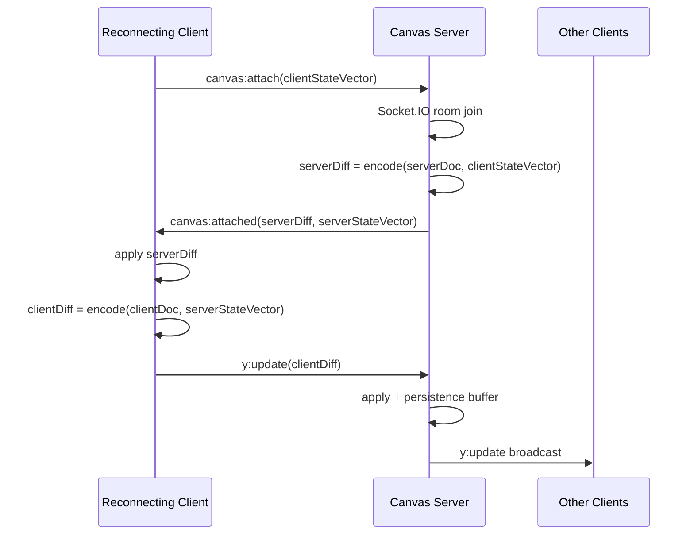

# Yjs 재접속을 양방향 diff handshake로 수렴시키기

앞선 작업에서는 캔버스 렌더링과 Yjs projection의 성능 병목을 줄였다. 성능 개선을 마친 뒤에는 네트워크가 끊긴 동안 클라이언트와 서버가 각각 수정된 경우에도 최종 상태가 같아지는지를 확인했다.

기존 구현은 `canvas:attach` 시 서버 문서 전체를 클라이언트로 내려주는 단방향 초기화였다. 서버 변경은 클라이언트에 적용됐지만, 클라이언트가 오프라인 동안 만든 변경을 서버가 무엇을 모르는지 비교하는 application-level handshake는 없었다.

Socket.IO는 일시적인 연결 중단 중 발생한 emit을 내부 버퍼에 보관할 수 있다. 하지만 데이터 수렴을 라이브러리의 암묵적인 전송 순서와 버퍼에만 맡기면 서버 재시작, attach 처리 순서, 재연결 직후 편집 같은 상황을 프로토콜 수준에서 설명하거나 검증하기 어렵다.

이번 작업에서는 양쪽의 Yjs state vector를 교환해 서로에게 없는 update만 계산하고, handshake가 끝날 때까지 새 로컬 변경을 Y.Doc에 보존한 뒤 하나의 diff로 전송하도록 바꿨다.

## 요약

- 클라이언트가 `canvas:attach`에 자신의 Yjs state vector를 전송한다.
- 서버는 클라이언트에 없는 서버 update만 계산해 반환한다.
- 서버는 응답 시점의 state vector도 함께 반환한다.
- 클라이언트는 서버 diff를 적용한 뒤 서버에 없는 local update만 다시 계산해 전송한다.
- handshake 전 로컬 변경은 Socket.IO로 즉시 보내지 않고 Y.Doc에 유지한다.
- 서버는 snapshot 계산보다 Socket.IO room join을 먼저 수행해 attach 도중 발생한 update를 놓치지 않는다.
- 같은 key의 동시 수정과 동일 update 중복 적용을 포함한 수렴 테스트를 추가했다.
- 새 struct를 만들지 않는 삭제 update도 빈 diff로 오판하지 않도록 update의 delete set을 함께 확인한다.
- 구버전 FE와 BE가 섞여도 기존 전체 동기화 방식으로 fallback한다.
- medium fixture와 같은 합성 문서에서 PostIt 한 개의 x 좌표만 변경했을 때 서버 binary 전체 상태는 322,911B, state-vector diff는 29B였다.

## 1. 기존 재접속 흐름의 빈 부분

기존 attach는 다음 흐름이었다.

```text
클라이언트 연결
→ canvas:attach
→ 서버 Y.Doc 전체를 encodeStateAsUpdate
→ canvas:attached로 클라이언트에 전송
→ 클라이언트가 서버 update 적용
```

클라이언트가 연결된 동안 만든 update는 `doc.on('update')`에서 바로 서버로 전송됐다. 반면 연결이 끊긴 동안에는 서버가 해당 변경을 알 수 없다.

```text
공통 상태 S0

오프라인 클라이언트: S0 + 변경 C
서버:               S0 + 변경 S
```

재접속 시 서버의 변경 S를 클라이언트에 적용하면 클라이언트는 `S0 + C + S`가 된다. 하지만 기존 `canvas:attached` handler는 적용 이후 클라이언트 변경 C를 서버로 다시 전송하지 않았다.

일시적인 disconnect에서는 Socket.IO send buffer가 C를 전달할 수도 있다. 그러나 다음 조건까지 application code가 보장하는 구조는 아니었다.

- 서버 프로세스가 재시작되어 메모리 Y.Doc이 사라진 경우
- buffered update가 attach보다 먼저 처리되는 경우
- attach snapshot 계산과 room join 사이에 다른 update가 발생한 경우
- 재접속 직후 handshake 완료 전에 사용자가 다시 편집한 경우

그래서 특정 라이브러리 동작에 기대는 대신 Yjs가 제공하는 state vector로 양방향 동기화를 명시했다.

## 2. state vector가 표현하는 것

Yjs state vector는 문서 전체 데이터가 아니라 각 Yjs client가 생성한 struct를 어디까지 알고 있는지를 표현한다.

```text
Client A: clock 120까지 보유
Client B: clock 85까지 보유
```

상대방의 state vector를 알고 있으면 다음 함수로 상대에게 없는 update만 만들 수 있다.

```ts
encodeStateAsUpdate(localDoc, remoteStateVector)
```

따라서 전체 문서를 서로 덮어쓰지 않고 양쪽 차이만 교환할 수 있다. Yjs update는 멱등성과 교환 가능성을 가지므로 같은 update가 중복되거나 서로 다른 순서로 적용돼도 최종 문서가 수렴한다.

## 3. 양방향 attach handshake

변경한 프로토콜은 다음과 같다.



attach 요청에는 클라이언트 state vector를 추가했다.

```ts
{
  roomId,
  canvasId,
  clientStateVector: Array.from(encodeStateVector(doc)),
}
```

서버는 자신의 전체 문서 대신 클라이언트가 모르는 부분만 응답한다.

```ts
const update = encodeStateAsUpdate(serverDoc, clientStateVector)
const serverStateVector = encodeStateVector(serverDoc)
```

클라이언트는 서버 diff를 먼저 적용한다. 그 다음 서버 state vector를 기준으로 현재 클라이언트 문서에만 있는 update를 계산한다.

```ts
applyUpdate(clientDoc, serverDiff, socket)

const clientDiff = encodeStateAsUpdate(clientDoc, serverStateVector)
socket.emit('y:update', { canvasId, update: Array.from(clientDiff) })
```

이 시점의 clientDoc에는 기존 offline 변경과 방금 받은 server 변경이 모두 들어 있다. server state vector는 응답 시점의 서버가 아는 범위이므로 `clientDiff`에는 서버에 없는 client-only 변경만 남는다.

## 4. 빈 update와 삭제 update를 구분했다

두 문서가 이미 같으면 `encodeStateAsUpdate`도 형식상 작은 binary를 반환한다. 이를 그대로 보내면 의미 없는 update가 persistence buffer와 broadcast 경로에 들어간다.

반대로 byte 길이만 보고 빈 update를 판단하면 삭제 변경을 놓칠 수 있다. Yjs 삭제는 새 struct 없이 delete set에만 기록될 수 있기 때문이다.

그래서 update를 decode해 두 영역을 모두 확인한다.

```ts
const decoded = decodeUpdate(update)

const isEmpty = decoded.structs.length === 0 && decoded.ds.clients.size === 0
```

테스트에서는 기존 배열 항목을 삭제한 뒤 생성된 diff가 실제로 상대 문서의 삭제를 재현하는지 확인했다.

## 5. handshake 중 새 update를 잠시 보존했다

Socket 연결 완료와 Yjs 문서 동기화 완료는 같은 상태가 아니다.

```text
Socket connected
→ attach 전송
→ server diff 계산
→ attached 수신
→ 양방향 diff 교환 완료
→ Yjs synced
```

재접속 직후 attached 응답 전에 사용자가 편집하면 Socket은 연결 상태이므로 기존 코드는 update를 바로 보냈다. 서버가 attach에서 DB 문서를 불러오는 중이라면 `y:update`가 먼저 처리될 수 있다.

이를 막기 위해 내부 `syncReadyRef`를 추가했다.

```text
disconnect 또는 connect 시작
→ syncReady = false

syncReady = false에서 발생한 로컬 변경
→ Y.Doc에는 반영
→ Socket으로 즉시 전송하지 않음

canvas:attached 처리 완료
→ 누적된 로컬 변경을 clientDiff 한 번으로 전송
→ syncReady = true
```

오프라인 변경을 별도 queue에 복제하지 않고 Y.Doc 자체를 source of truth로 사용한다. 중간 update 여러 개를 모두 재생하는 대신 현재 서버가 모르는 최종 CRDT diff만 보낸다.

## 6. room join과 snapshot 사이의 race를 제거했다

기존 서버 순서는 다음과 같았다.

```text
서버 snapshot 계산
→ Socket.IO room join
```

두 작업 사이에 다른 사용자의 update가 발생하면 새 클라이언트는 계산이 끝난 snapshot에도 포함되지 않고 아직 room에 없어서 broadcast도 받지 못할 수 있다.

순서를 다음과 같이 바꿨다.

```text
Socket.IO room join
→ 서버 snapshot과 diff 계산
→ canvas:attached 응답
```

join 이후 snapshot 계산 중에 update가 오면 다음 둘 중 하나 또는 둘 다로 전달될 수 있다.

- 계산된 server diff에 포함
- room broadcast로 수신

중복 적용은 Yjs가 안전하게 처리한다. 초기화가 실패하면 먼저 참여한 room에서 leave한 뒤 오류를 다시 전달한다.

## 7. rolling 배포 호환성을 유지했다

FE와 BE가 동시에 교체된다는 보장은 없으므로 두 방향의 fallback을 추가했다.

```text
신형 BE + 구형 FE
clientStateVector 없음
→ 서버 전체 update 반환

신형 FE + 구형 BE
serverStateVector 없음
→ 서버 update만 적용하고 역방향 diff는 생략
```

손상된 client state vector가 들어오면 내부 서버 오류로 처리하지 않고 `BadRequest`로 거절한다. attach 초기화 실패 시에는 room join도 되돌린다.

## 8. 수렴 테스트

실제 운영 서버에 의존하지 않고 Y.Doc과 gateway mock을 사용해 다음 조건을 검증했다.

| 시나리오                               | 검증 결과                                   |
| -------------------------------------- | ------------------------------------------- |
| 서버에만 새 변경이 있음                | client state vector 기준 server diff만 반환 |
| 클라이언트에만 새 변경이 있음          | attached 후 client diff를 서버로 전송       |
| 서버와 클라이언트가 각각 다른 key 수정 | 양방향 교환 후 두 문서 일치                 |
| 같은 key를 동시에 수정                 | Yjs conflict resolution 후 두 문서 일치     |
| 같은 update를 서버에 두 번 적용        | 최종 상태 변화 없이 수렴                    |
| 기존 항목 삭제                         | delete set을 포함한 diff로 삭제 상태 수렴   |
| 이미 같은 문서                         | 빈 client update를 전송하지 않음            |
| 손상된 state vector                    | BadRequest                                  |
| 구버전 FE 또는 BE                      | 기존 전체 동기화 fallback                   |
| attach 초기화 실패                     | 먼저 join한 room에서 leave                  |

최종 검증 결과는 다음과 같다.

```text
Frontend: 8개 파일, 24개 테스트 통과
Backend: 33개 suite, 332개 테스트 통과
Frontend TypeScript / ESLint / production build 통과
Backend TypeScript / ESLint / production build 통과
```

## 9. diff 전송량 확인

기존 medium 성능 fixture와 같은 개수로 합성 Y.Doc을 만들었다.

```text
PostIt: 250개
PlaceCard: 100개
Line: 193개
Line points: 20,882쌍
TextBox: 50개
```

클라이언트가 이 상태를 모두 가진 뒤 서버의 PostIt 한 개에서 `x`만 변경했다.

| 전송 방식                     | Yjs binary 크기 |
| ----------------------------- | --------------: |
| 서버 전체 상태                |        322,911B |
| client state vector 기준 diff |             29B |
| 감소율                        |         99.991% |

이 값은 합성 문서의 Yjs binary 기준이며 Socket.IO framing과 `number[]` JSON 직렬화 크기는 포함하지 않는다. 모든 재접속이 29B가 된다는 의미도 아니다. 클라이언트가 서버와 대부분 같은 상태이고 변경이 한 건뿐인 조건에서 전체 상태 대신 차이만 보낸 효과를 확인한 수치다.

## 10. 남아 있는 한계

이번 작업은 연결이 살아 있는 클라이언트의 in-memory Y.Doc과 서버 Y.Doc이 재접속 후 수렴하는 범위를 다룬다.

다음 문제는 별도 작업으로 남아 있다.

- 브라우저 탭을 완전히 닫으면 in-memory offline 변경은 사라진다.
- 서버는 update를 메모리에 적용한 뒤 5초 buffer로 DB에 저장하므로 durable acknowledgement는 아니다.
- 프로세스가 강제 종료되면 flush되지 않은 update의 내구성 문제가 남는다.
- DB update log는 계속 누적되며 `CategorySnapshot` 모델은 아직 사용하지 않는다.
- 여러 backend instance가 각자 Y.Doc을 가질 때의 분산 동기화는 다루지 않았다.
- update payload의 `number[]` 직렬화 오버헤드는 그대로다.

따라서 이번 결과를 서버 장애에도 데이터가 절대 유실되지 않는 구조라고 표현하지 않는다. **네트워크 재접속에서 FE와 BE가 서로의 누락 변경을 명시적으로 교환해 Yjs 문서가 수렴하도록 만든 작업**이다.

다음 단계는 snapshot compaction과 persistence flush의 내구성을 별도 브랜치에서 다루는 것이다.

## 11. 정리

이번 작업 전에는 재접속이 다음 의미에 가까웠다.

```text
서버 전체 상태를 클라이언트에 다시 적용
```

변경 후에는 다음 계약을 갖는다.

```text
서버가 클라이언트에 없는 변경을 계산
＋
클라이언트가 서버에 없는 변경을 계산
＋
handshake 중 update 순서를 통제
＝
양쪽 Y.Doc 수렴
```

프론트에서는 연결과 동기화 완료를 분리하고, 백엔드에서는 state vector 기반 diff와 room join 순서를 책임지도록 경계를 나눴다. 이를 통해 재접속 동작을 Socket.IO의 암묵적 버퍼링이 아니라 테스트 가능한 application protocol로 만들었다.
